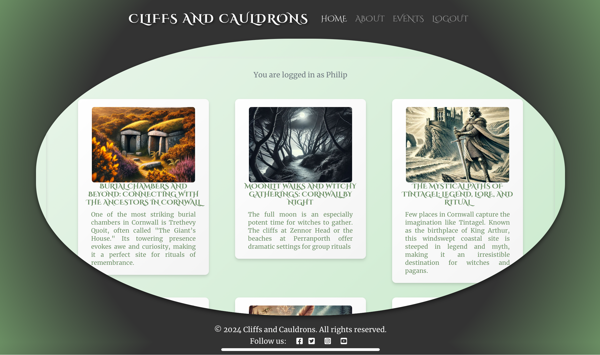

# Cliffs and Cauldrons

This project is a blog platform inspired by Cornish witchcraft and pagan spirituality, offering a rich collection of blog posts that explore all things spiritual, witchy, and pagan themed. Visitors are welcome to freely browse through the site, choose which blog posts they'd like to read and then they are able to delve into various aspects of these traditions.

In addition to the blog, the platform also features an "Events" page, where users can explore details about upcoming spiritual gatherings, workshops, and other related upcoming events in the area.  

Registered users can enhance their experience further by contributing to the community through the comments section on each blog post, fostering discussion and connection.
The blog also features a 'contact me' form for anyone who wishes to collaborate with the page, for instance they may want to offer some ideas for blog content or they might have an event they'd like the site to advertise for them. 

##  UX Design 
## Wireframes

#### Wireframe Design for desktop

#### Wireframe Design for smaller screens

### Colour Scheme

#### Primary Colours

The colour pallete was created in <a href=https://coolors.co/>Coolors.co</a> with a focus on earthy greens for grounding, and a calming feel. The pale green (#c5e8c8) is inviting, easy on the eyes and complimentary to the magical theme the blog sits in. Using dark green (#6a8e63) for button backgrounds provides a strong contrast to the pale green background, reinforcing the nature theme and creating a cohesive colour scheme.
Gold (#d9a441) was selected to be used sparingly as an accent colour for hover effects, titles and  decorative elements. Providing a subtle glow that conveys a sense of alchemy, magic and sophistication. Gold aligns with the witchy mystical realm of spirituality and is perfectly placed within the blog to reinforce the witchy theme.

#### Secondary Colours 

#ffffff to #f4f4f4 Gradient, a shiny white is used for the blog cards for a soft and shiny effect, providing a modern, clean and fresh appearance, allowing the blog posts to stand out from the pale green background.
Neutral gray (#333333) is useed for all other body text as a contrast, complimenting the greens and golds without overwhelming the overall design. 

All the colours have been inspired by the natural elements that surround us, greens for earth elements, gold for magic, mystery and spirituality. They strike a balance of being calming and soothing with some vibrant tones to promote a feeling of enchantment whilst also ensuring the site doesn't become garish and overwhelming.

### Fonts

Cinzel Decorative was selected for the headings as it evokes a sense of elegance combined with mysticism. With its inspiration pulling from classical Roman inscription, it perfectly portrays a magical, mystical and witchy mood on the Cliffs and Cauldrons Blog. Choosing to use the font in bold and uppercase along with its decorative flourishes provides a dramatic and striking effect for the blog.

In contrast, Merriweather is an elegant and highly readable serif font and was chosen to ensure the larger bodies of text are accessible and easy to read. Merriweather, placed alongside the dramatic Cinzel Decorative, provides a calmer, sophisticated text to calm the user, offering a modern yet timeless feel alongside the drama of Cinzel Decorative.

## Conclusion

The choice of fonts and colours represents the theme of Cliffs and Cauldrons as a magical mystical, but earthly based grounded blog that maintains accessabilty, readability and a modern aesthetic. The font choices create a harmony of both drama and elegance whilst the nature inspired palette complements the chosen texts.

The sticky navbar ensures easy navigation across the site while blending into the overall design.
The footer was kept minimal and consistent, offering clear links to social media for continued engagement.

### Cauldron Effect
The circular "cauldron effect" was designed to create a unique and immersive reading experience, symbolizing the central theme of magic and ritual.
This shape frames the content in a way that makes it feel special and intentional, drawing the user's focus.

The site is designed to work seamlessly across devices, from desktops to smartphones. The cauldron layout adapts dynamically to fit smaller screens while maintaining its circular aesthetic.

The design avoids clutter, focusing on clean and simple layouts to ensure users can focus on the blog's content without distractions.

I made sure that both text and background colours meet WCAG standards for contrast and readability issues.  Hover effects are subtle yet readable, using a colour change rather than underlines to improve the clarity of the text. Gold has been used sparingly with the knowledge that it could cause issues if there's not enouggh contrast against the backgrounds.

## User Stories

### Must Have User Stories

**As a site user I can view a selection of blog posts on the homepage**

 - Homepage to display a selection of blog posts, two rows of three posts

**As a site user I can click on a post so that the full post can be read**

 - When the blog post title is clicked the full blog post is seen

 **As an admin I can create, edit and delete blog and event content so that my audience can read blog posts and event posts**

  -  Create, edit and manage the post selection, about page and events listings via the database.

  -  Create draft posts so that they can be published at a later date.

  -  When a user is on the home page they can see and move through the blog posts, event posts

  **As a user I can click on the events link so I can view a list of upcoming events**

  -  When the events link is clicked it opens a page showing the list of upcoming events

**As a user I can click on the events link so I can view the event full details**

 - When the events link is clicked it opens a page showing the details of the event

**As a site user I can register an account so that I can comment on the blog posts**

   - Username and Password fields to register

  -  Once registered, the user can then log in

  -  A logged in user can then comment on the blog posts

  -  On page notifications show me whether I'm currently logged in, or logged out

**As a site user I can create a comment so that join in the conversation on the blog posts**

  -  comment to be approved then added to the blog page

   - several comments can be shown to create a conversational dialogue

**As a site user I can modify or delete my comment so that I can correct any errors and play a part in the conversation**

  -  A logged in user can modify their posts

- A logged in user can delete their posts

**As an admin I can check, approve and delete users comments so that I can filter out objectionable comments**

  -  Can approve acceptable comments and allow them to be posted.

  -  Can disapprove a comment and prevent objectionable comments from appearing.

**As a site user or admin I can view comments so that I can see the full conversation**

  -  Comments can viewed underneath the blog posts by both site user and admin.

**As a site user or admin I can add, edit or delete a comment so that I can interact with the blog page via the comments section**

  -  Provide full Crud functionality on the comment area.

  -  Provide feed back messages to reassure their comment has been received or edited,

   - Provide a warning to prevent accidental deletion of their comments.

### Should have User Stories 

**As a user I should be able to fill in a form so that I can collaborate with the blog onwer.**

- A form needs to be at the bottom of the about page

**As a user I should see a notification so that I know I submitted, or edited my comment**

- Text appears in the comment section to confirm post submitted and awaiting approval

**As a user I should see a warning sign to ensure I want to delete a post**

- A warning pops up to make sure the user really wants to delete their post

### Could have User Stories 

**As a user I could click on a featured event highlighted on the blog page**

- A Button link to an event of a similar nature as the blog details

#### for later iterations
**As an admin I can create a poll or survey so that site users feel more involved in the community**

  -  Design a poll

  -  Design a Survey

 -   Store all collected data safely

Agile Methodology was used throughout the project 
 

                       

## Features

 -  Home Page 

 The home page offers the user a choice of blog posts that can then be clicked on to read the blog of their choice in more detail.
 

 

 - Events Page

 The events page offers the user a choice of event posts organised in the same manner as the blog posts for continuity, these event posts can also be clicked on to read the event details of the event they are interested in.

 

 - About Page

 The about page gives information about the blog post creator and provides a form at the bottom of the page inviting site users to contact the creator to collaborate, or to submit details of any of their events they'd like the blog page to advertise.

 

 - Blog detail Page

 Shows the blog in full and includes an area after the blog for a featured event of a similar nature to be brought to the site readers attention as it may be of interest to them.

 
 

  - Event Detail Page

  Shows each event in detail 

  

 

 - Event detail Page

 - Contact Form

 

 - Leave a comment 

 

 - Navigation is provided by a bootstrap navbar on larger screens and toggler on smaller screens

 
 

 - There are also register, sign in and sign out pages

 
 
 

 - Admin Features

 The site has a facility for designated admin staff to sign and order the site via Django's admin interface

 

 -  Entity Relationship Diagram

.png)

## Testing

Manual Testing

## Responsive Testing 

The site was tested for responsivity throughout the build with Chrome Dev tools, it was also tested on different devices, ipad Pro, iPhone, desktop and laptops

## Validator Testing

 - HTML

 W3C validator

 

  - CSS

  W3C validator

  

   - Python

   PEP8 

   The only code that didn't pass was the code automatically generated by Django

 - Javascript

    JSHint

## Deployment

The site was deployed to Heroku from the main branch of the github repository early in the development stages for continuous deploying and checking.

Heroku is set up with 3 environment variable, replacing the environment variables stored in the env.py, the env.py is then registered in the gitignore, therefore this information is not pushed back to git hub.

In order to create a new Heroku App:

 

## Credits:

- This blog is based on the "I think, Therefore I blog" project featured in the Code Institute LMS.

### Content
### Media
https://propercornwall.co.uk/events/montol-festival-2024/ - a local event

https://chatgpt.com/ - Created blog and event imagery and text
db diagram